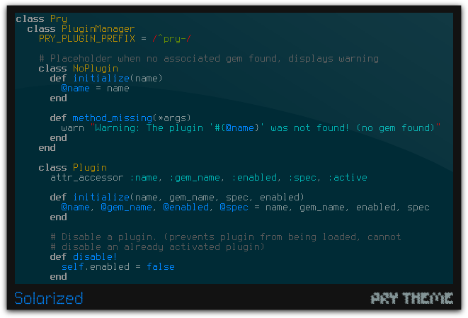
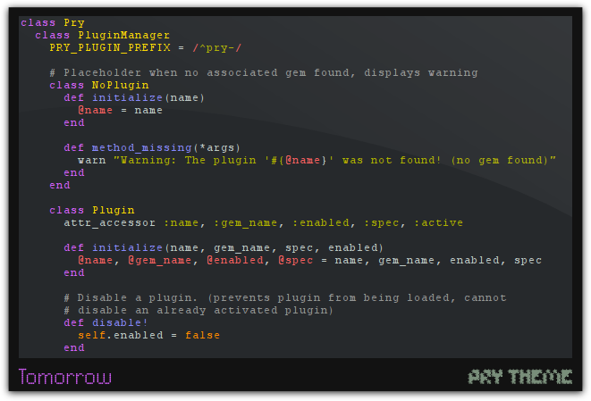

![Pry Theme][logo]

![Pry Theme version badge][ver-badge] [![Build Status][ci-badge]][ci-link]

* Repository: [https://github.com/kyrylo/pry-theme/][pt]
* Wiki: [https://github.com/kyrylo/pry-theme/wiki][wiki]

Description
-----------

Pry Theme is a plugin for [Pry][pry], which helps you to customise your Pry
colors via `prytheme.rb` files.

Installation
------------

All you need is to install the gem. The `pry-theme` plugin will be detected and
used automatically.

    gem install pry-theme

Synopsis
--------

### Theme files

Theme file is nothing but a Ruby file, which has `.prytheme.rb` extension (for
example, `beautiful.prytheme.rb`). In order to set up the desired theme, add the
following line to your `.pryrc`:

    Pry.config.theme = "theme-name"

The default theme is the one from the `pry-classic` family. It is dependent on
your terminal capabilities. For example, if you're using Windows, your default
theme will be `pry-classic-16`, since the Windows terminal can't support more
than 16 colours. If you're using xterm or urxvt, then your default theme will be
`pry-classic-256` (basically, you shouldn't notice it, because it resembles the
default outlook of Pry, as though Pry Theme isn't present). This outlines the
rule: the more colours your terminal supports, the more vivid version of
`pry-classic` is used.

Let's change it to something more neoteric:

    Pry.config.theme = "pry-modern"

That's all! Launch your Pry and you will see the changes.

### CLI

Pry Theme has a command-line interface available via Pry. Just launch Pry and
start working with it. For example, you can _temporary_ change themes on the
fly (only for the current session):

    [1] pry(main)> pry-theme try pry-classic

This subcommand would switch your current theme to `pry-classic` theme.

You can find [more information about CLI in Pry Theme Wiki][cli].

### Managing themes

Creating new themes isn't hard. [Check out Pry Theme Wiki article on that][new_theme].

Theme files must have `.prytheme.rb` extension. Check out [Pry Theme Collection][ptc]
if you want to find some themes other than default ones.

If you already have your theme stored somewhere on disk, just put it in the
`$HOME/.pry/themes` directory.

If you don't want to bother with routine operations, you can install a theme
from the Collection with help of `pry-theme install <name>` subcommand. For
example, you can want to install xoria256 theme. Just execute
`pry-theme install xoria256` and you're done.

Oh, and don't forget to adjust your `.pryrc`!

Limitations
-----------

No limitations. Pry Theme will run everywhere where you can launch Pry.

Credits
-------

* Thanks to [banister][johndogg] for bringing the plugin in masses and
  contributing a bunch of themes;
* Thanks to Karandashev for "Puzzle" font;
* Thanks to Creatica for "Dited" font;
* Thanks to [noprompt][noprompt] for a HEX to ANSI conversion Ruby
  implementation, which I borrowed from one of his projects.

License
-------

The project uses Zlib License. See LICENSE file for more information.

[pt]: https://github.com/kyrylo/pry-theme/ "Home page"
[ver-badge]: https://badge.fury.io/rb/pry-theme.png "Pry Theme version badge"
[ci-badge]: https://travis-ci.org/kyrylo/pry-theme.png?branch=master "Build status"
[ci-link]: https://travis-ci.org/kyrylo/pry-theme/ "Build history"
[logo]: http://img-fotki.yandex.ru/get/5107/98991937.a/0_7c6c8_871a1842_orig "Pry Theme"
[pry]: https://github.com/pry/pry/ "Pry's home page"
[new_theme]: https://github.com/kyrylo/pry-theme/wiki/Creating-a-New-Theme
[cli]: https://github.com/kyrylo/pry-theme/wiki/Pry-Theme-CLI
[wiki]: https://github.com/kyrylo/pry-theme/wiki
[ptc]: https://github.com/kyrylo/pry-theme-collection
[johndogg]: https://github.com/banister/ "John Dogg"
[noprompt]: https://github.com/noprompt/ "Joel Holdbrooks"
